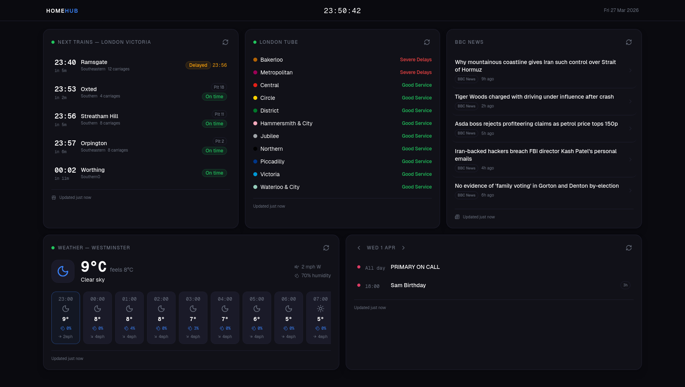

# HomeHub

A personal home dashboard for your TV or spare monitor. One dark screen, five live widgets — always up to date, no fuss.



---

## What's on screen

**Trains** — next departures from your local station, live from National Rail. See the platform, operator, and exactly how many minutes until each service leaves (or how late it's running).

**Tube** — London Underground line status at a glance. Disruptions highlighted in amber, everything else quietly green.

**Weather** — hourly forecast for your location from the Met Office. Current conditions, feels-like temperature, wind, humidity, and rain probability for the next 24 hours.

**Calendar** — today's events from your iCal or Google Calendar. Browse forward and back by day with the arrow keys. All-day events, timed events, locations — all in one clean list.

**News** — latest BBC News headlines with publication times, refreshed every few minutes.

---

## Get started

```bash
npm install
cp .env.example .env.local   # then fill in your keys
npm run dev
```

Open [http://localhost:3000](http://localhost:3000).

See `.env.example` for all the available settings — most have sensible defaults and only a handful of API keys are needed (all free).

---

## API keys you'll need

| Widget | Where to get it |
|--------|----------------|
| Tube | [api.tfl.gov.uk](https://api.tfl.gov.uk) — free registration |
| Weather | [datahub.metoffice.gov.uk](https://datahub.metoffice.gov.uk) — free tier |
| Calendar (iCal) | Your private iCal URL from iCloud, Outlook, or Google Calendar |
| Trains | No key needed — optional token at [huxley2.azurewebsites.net](https://huxley2.azurewebsites.net) for higher limits |
| News | No key needed |
